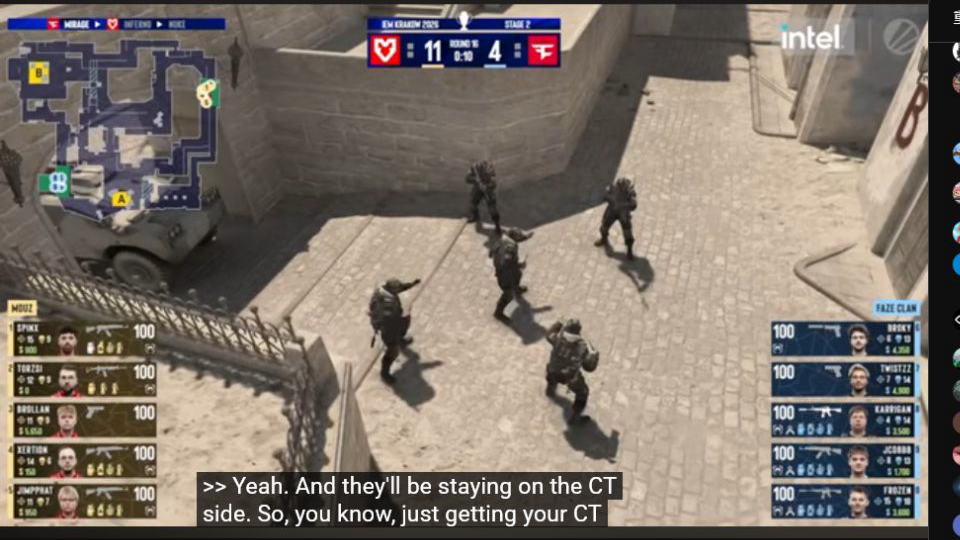
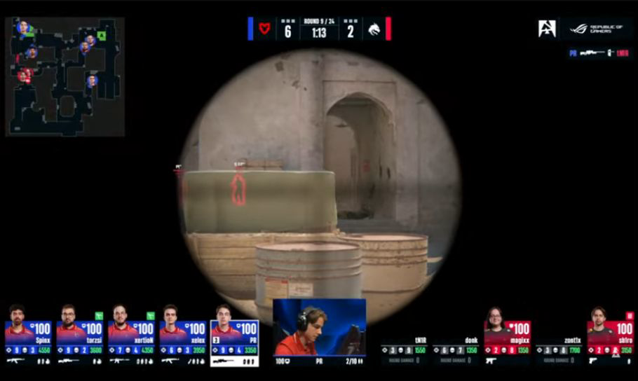
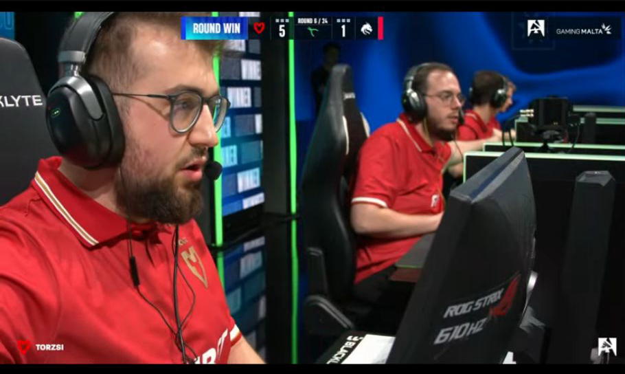
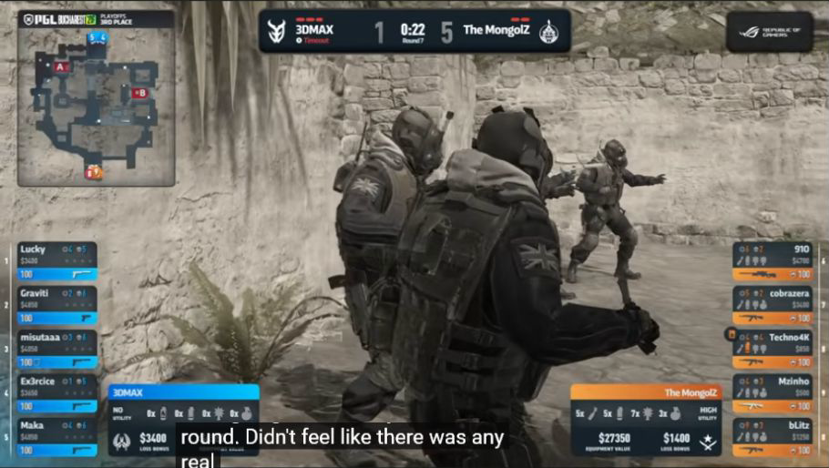
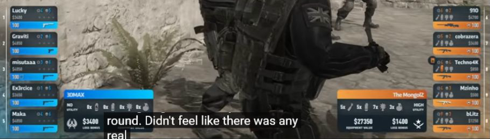
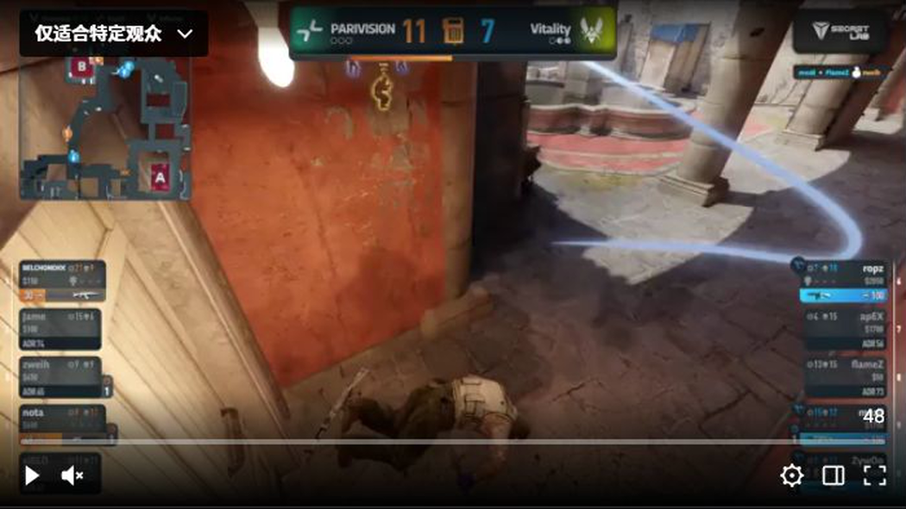
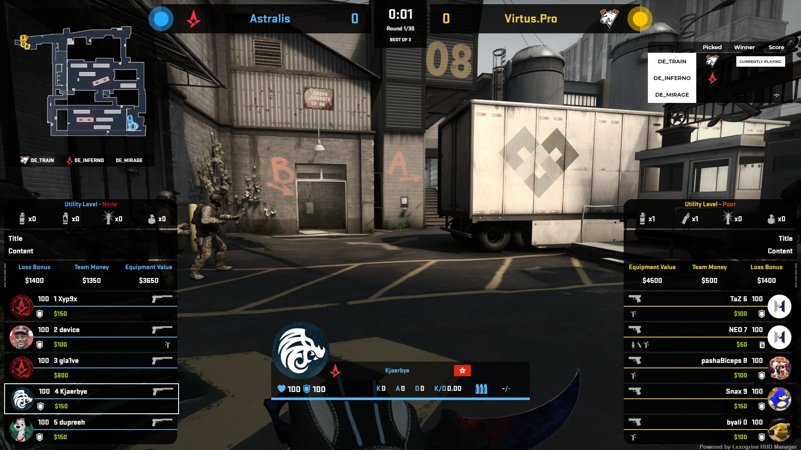
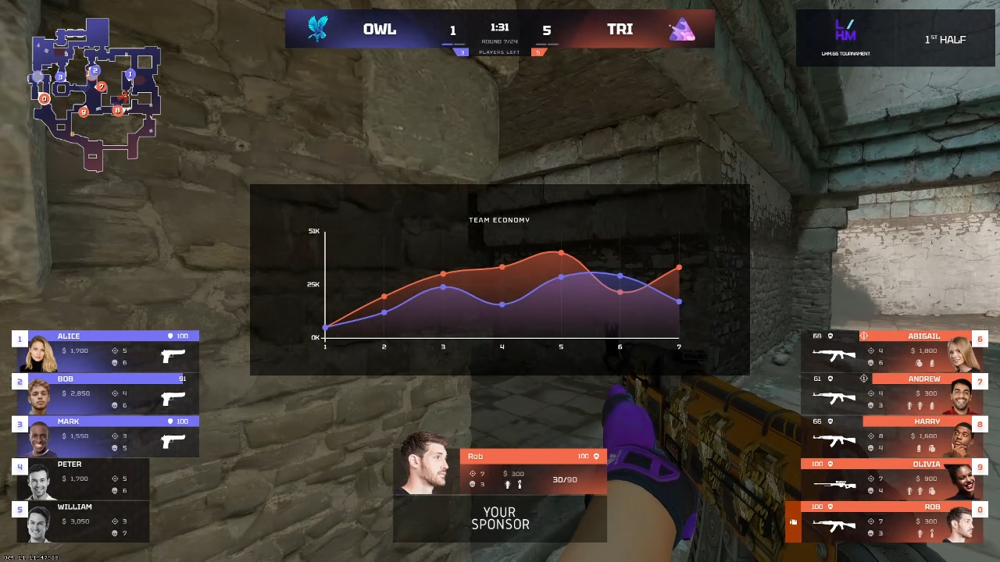

# MYTVHUD 游戏 HUD 横向研究与缺失功能清单

更新时间：2026-08-02  
状态：仅研究与取证，尚未修改游戏 HUD 代码

## 1. 研究边界

本次只检查比赛进行中的游戏 HUD，不把 BP、地图间播出、系列赛结束、赛事待机页面混入比较。

对照来源包括：

- [ESL Counter-Strike：IEM Krakow 2026 正式直播](https://www.youtube.com/watch?v=8blHz4yAer8&t=4500s)
- [BLAST Premier：BLAST Bounty Malta 2026 正式直播](https://www.youtube.com/watch?v=5XRoifLuVvQ&t=3600s)
- [PGL：PGL Bucharest 2026 正式直播](https://www.youtube.com/watch?v=v0-0BDYKLUg&t=7200s)
- [PGL：ZywOo Clutch 正式频道剪辑](https://www.twitch.tv/pgl/clip/SpookyDeadDogeBlargNaut-8-fGmH9CMxokFoMz)
- [Lexogrine CS2 React HUD](https://github.com/lexogrine/cs2-react-hud)
- [Lexogrine HUD Manager](https://github.com/lexogrine/hud-manager)
- [JTs HUD](https://github.com/JohnTimmermann/JTs-Hud)
- [M3MONs CS2-HUD](https://github.com/M3MONs/CS2-HUD)
- [drweissbrot/cs-hud](https://github.com/drweissbrot/cs-hud)

## 2. MYTVHUD 当前已有内容

已从当前构建产物与类型文件核对到以下内容，因此不列为缺失功能：

- 两支战队的名称、图标和比分。
- 回合编号、回合时间、暂停状态。
- 雷达、玩家位置、存活状态、射击反馈、炸弹位置和道具位置。
- 选手头像、名称、生命值、护甲、头盔、金钱、当前武器、弹药和随身道具。
- 选手击杀数、死亡数、当回合击杀数和死亡后的当回合伤害。
- 炸弹安放、爆炸、拆除、拆包倒计时和拆包钳状态。
- 战术暂停归属、剩余暂停次数和暂停倒计时。
- BO1、BO3、BO5 的系列赛地图比分状态。
- 焦点选手基础条：头像、名称、生命值、护甲、弹药。

当前构建产物中没有出现自定义击杀信息流、残局提示、队伍经济汇总、回合胜利提示、加时视觉标签、技术暂停原因或焦点选手深度数据组件。

## 3. 截图对照

### 3.1 ESL：常规比赛信息层级

这张图用于确认常规 HUD 的稳定层级：雷达在左上，比分和时间居中，双方选手卡分列两侧。MYTVHUD 已覆盖这组基础功能，后续不需要照搬 ESL 的版式，只需继续优化信息密度和可读性。

### 3.2 BLAST：底部选手卡与品牌化击杀信息流

右上角有独立于 CS2 原生界面的品牌化击杀条；底部选手卡同时容纳头像、生命值、金钱、武器、道具和存活状态。当前 MYTVHUD 已有底部选手信息，但没有品牌化击杀条。

Lexogrine 的公开实现进一步明确了击杀条可承载：击杀者、被击杀者、助攻、闪光助攻、武器、爆头和穿墙，并支持入场、停留、退场动画及回合清空。

### 3.3 BLAST：回合结束结果提示

比分条旁出现独立的回合胜利提示，观众无需等待比分数字变化后再推断回合结果。当前 MYTVHUD 只更新比分，没有对应的短时结果提示。

### 3.4 PGL：冻结时间队伍经济汇总

冻结时间除个人金钱和装备外，还显示队伍装备总价值、败方奖励及道具储备强弱。当前 MYTVHUD 只显示个人金钱、个人装备和购买金额变化，没有队伍级经济结论。

### 3.5 PGL：残局中的存活信息

双方选手卡在残局中持续保留，死亡选手降权，当前存活选手保持高亮。MYTVHUD 已有死亡降权，但没有居中的“存活人数”或“1 对多”残局提示，观众仍需逐张数选手卡。

### 3.6 开源 HUD：经济、败方奖励和焦点选手信息

Lexogrine 的公开示例同时展示队伍总金钱、装备价值、败方奖励、道具等级、系列赛地图和焦点选手数据。这张图证明这些内容可以作为透明 OBS HUD 的组成部分，而不必转为独立数据页面。

### 3.7 开源 HUD：战术分析层

画面中心的队伍经济趋势图属于战术分析层，不应长期覆盖游戏画面。它适合在冻结时间或暂停时短时出现，因此列为低优先级，不纳入第一批核心 HUD 重构。

## 4. MYTVHUD 缺失功能清单

| 优先级 | 功能 | 当前缺口 | 建议显示时机 | 现有数据基础 |
| --- | --- | --- | --- | --- |
| 第一批 | 品牌化击杀信息流 | 没有自定义击杀条 | 击杀发生后短时显示，回合结束清空 | `KillEvent` 已包含击杀者、被击杀者、助攻、闪光、爆头、武器、穿墙、烟中击杀、盲杀和空中击杀字段 |
| 第一批 | 冻结时间队伍经济汇总 | 只有个人金钱与装备 | 每回合冻结时间 | 玩家状态已有 `money`、`equip_value`，队伍状态已有 `consecutive_round_losses` |
| 第一批 | 存活人数与残局提示 | 只能逐张数选手卡 | 存活人数下降时；形成 1 对多时重点显示 | 可以从双方选手的队伍与生命状态计算 |
| 第一批 | 回合结果提示 | 只更新比分 | 回合结束后短时显示 | `Score` 已包含胜方、负方、地图及地图是否结束 |
| 第二批 | 半场与加时视觉状态 | 顶部仅有回合编号和时间 | 上半场、下半场、加时开始及加时阶段 | 类型中存在加时相关字段；开发前必须用一场真实加时 DEMO 核对实际报文 |
| 第二批 | 技术暂停完整提示 | 战术暂停有归属与倒计时，普通暂停只显示 `PAUSED` | 技术暂停或管理员暂停 | 当前阶段状态能识别暂停；现有报文没有提供暂停原因文本，原因只能显示为通用“技术暂停”或由导播录入 |
| 第二批 | 焦点选手深度信息条 | 焦点条只有头像、名称、生命、护甲和弹药 | 观战对象切换后常驻或短时展开 | 最终地图快照已有击杀、助攻、死亡、爆头数和 ADR；直播 ADR 需要接入实时累计逻辑 |
| 第三批 | 队伍经济趋势图 | 没有逐回合经济趋势可视化 | 冻结时间、战术暂停 | 需要按回合保存双方队伍经济快照后再生成曲线 |

## 5. 第一批功能的具体边界

### 5.1 品牌化击杀信息流

必须包含：

- 击杀者与被击杀者。
- 双方颜色或战队色区分。
- 武器图标。
- 爆头、穿墙、烟中击杀、盲杀、空中击杀标记。
- 普通助攻与闪光助攻。
- 多条击杀的堆叠顺序。
- 平滑入场、停留和退场。
- 回合切换时清空，不携带上一回合记录。

### 5.2 冻结时间队伍经济汇总

必须包含：

- 双方装备总价值。
- 双方当前总金钱。
- 双方败方奖励档位。
- 买枪结论：全起、强起、半起、纯经济局。
- 道具总量或道具储备等级。

这部分只在冻结时间展开；回合开始后收起，避免长期占用游戏画面。

### 5.3 存活人数与残局提示

必须包含：

- 双方存活人数，例如 `3 对 2`。
- 形成一名选手对多人时切换为 `1 对 2`、`1 对 3` 等残局提示。
- 回合结束后显示残局成功或失败，再与回合结果提示衔接。

死亡选手卡已有降权逻辑，需要保留，不与新提示重复抢夺视觉中心。

### 5.4 回合结果提示

必须包含：

- 获胜方。
- 回合胜利结果。
- 与顶部比分的同步更新。
- 短时显示后自动退出。

回合胜利原因是否细分为歼灭、爆炸、拆包、时间耗尽，需要在开发前核对当前 `Score` 事件是否提供精确原因；现有类型只证明胜方、负方、地图和地图结束状态。

## 6. 不纳入本轮游戏 HUD 的内容

- 玩家摄像头：当前项目没有比赛现场的稳定摄像头源。
- AI 自动导播：属于观察端工具，不是 HUD 组件。
- 观察位重排、隐藏教练：属于导播管理能力，不是观众画面功能。
- 赛后完整数据板、地图间道具回放：已经归属于播出控制页面，不应重新塞进比赛 HUD。
- BP 与系列赛结束动画：继续使用统一播出地址，不进入游戏 HUD。

## 7. 待确认事项

请按编号确认是否进入下一步设计：

1. 品牌化击杀信息流。
2. 冻结时间队伍经济汇总。
3. 存活人数与 1 对多残局提示。
4. 回合结果提示。
5. 半场与加时视觉状态。
6. 技术暂停完整提示。
7. 焦点选手深度信息条。
8. 队伍经济趋势图。

确认后再进入 HUD 版式设计、字段协议和动画时序阶段；本文件不代表已经决定全部开发。
